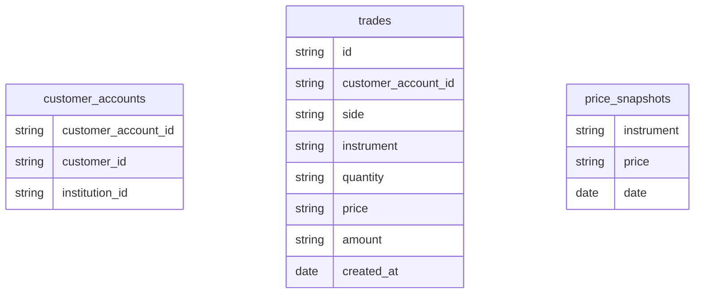

# dbt project: Anlytics pipeline for positions and assets analysis over time

## Introduction

This project demonstrates my ability to **design, implement and maintain a scalable and flexible ELT pipeline with dbt and Postgres**. The main objective here is to track **customer positions and portfolio values over time** and to produce daily snapshots — even for days without trades — to enable accurate financial and operational analysis.

This repository serves as **a portfolio piece**, reflecting my coding style, architecture decisions and best practices when designing scalable data pipelines.

## Project overview

I aimed to track how customer & partner positions change over time and monitor the evolution of total Assets under Custody (AuC) daily for a fictional company. The pipeline parses and transforms raw trades and price snapshots into daily positions and portfolio values.

It performs:

1. Conversion of monetary and fractional fields into proper decimal values.

2. Forward-filling to handle non-trading days.

3. Daily snapshots at customer and institution levels.

4. Validation through extensive testing.

5. A scalable architecture designed for future growth.

### Tech stack

1. **dbt:** transformation framework
    1. **dbt-utils:** utility packages for testing
2. **Postgres:** analytical database
3. **Docker compose:** lightweight and reproducible environment
4. **Python:** scripting and local orchestration

## Database schema


### Table descriptions

**customer_accounts:**
- `customer_account_id`: Unique identifier for the customer's account.
- `customer_id`: Unique identifier for the customer.
- `partner_id`: Identifier for the partner where the customer is registered.

**trades:**
- `id`: Unique identifier for each trade.
- `customer_account_id`: Identifier of the customer's account that executed the trade.
- `side`: Indicates the trade direction (buy or sell).
- `instrument`: ISIN (International Securities Identification Number) of the traded instrument.
- `quantity`: Number of shares traded.
- `price`: Price per share at the time of the trade.
- `amount`: Total value of the trade (calculated as quantity × price).
- `created_at`: Timestamp of when the trade occurred.

**price_snapshots:**
- `instrument`: ISIN of the instrument.
- `price`: Price of the instrument at the time of the snapshot.
- `date`: Date when the price snapshot was recorded.

### Handling numeric values

I have used the following formula to handle numeric values, because I have aimed for specificity to avoid floating point issues:

- Actual value = amount / 10^(scale) + currency

**Example:**
* (7429,2,EUR) = 74.29 EUR
* (9,3) = 0.009
* (-9,3) = -0.009

## Installation and Run
> **WARNING**: Run `dbt deps` to install needed packages as project has dependencies to it.

```bash
docker-compose up -d
python3 -m venv venv
source venv/bin/activate
pip install -r requirements.txt
dbt deps
dbt seed
dbt run
dbt test
```

# Solution proposal

## Coding style

I have applied a consistent naming convention throughout the models:

1. Column names include context from the model (e.g. `customer_account_id` becomes `customer_account_fk`).

2. IDs are renamed to use `*_fk` (foreign key) or `*_pk` (primary key) to clearly indicate relationships.

3. Date fields end with `_dt` (e.g. `created_at` becomes `trade_created_dt`).

4. Booleans (not present in this dataset) would follow the `is_*` or `has_*` prefix style.

    ```
    customer_account_id = customer_account_fk
    price AS trade_price
    created_at AS trade_created_dt
    ```
I also explicitly name the source data in CTEs. While this takes a bit more effort to write, it significantly improves readability and traceability — especially during debugging. I prioritize clarity over premature performance optimizations. I find that this approach pays off when the models grow or require troubleshooting.

## Architecture & design - My approach

The following architecture has been designed to support a scalable and maintainable data warehouse. By default, all layers except marts are materialized as `view` to allow for faster iterations and easier debugging during development. For datasets that are large, slow to process, or updated infrequently, models can be explicitly materialized as `table` by overriding the configuration at the model level.

I did not add any dimension tables beyond `dim_trading_days`, since the available source data was sufficient for reporting needs. If required, I could also promote `stg_customer_accounts` to a dimension model and include it in the dimensions layer.

In summary:

1. **Scalable layers:** 

    staging, intermediate, dimensions, marts
2. **Materialization:** 

    view during development; table and incremental for large growing models
3. **Design philosophy:**

    DRY, reusable, forward-filling

```
staging: +materialized: view
intermediate: +materialized: view
dimensions: +materialized: view
marts: +materialized: table

models/
├── dimensions/
│   └── dim_trading_days.sql
├── intermediate/
│   ├── int_clean_trades.sql
│   ├── int_daily_positions.sql
│   ├── int_filled_price_snapshots
│   └── int_price_snapshots.sql
├── marts/
│   ├── mart_customer_daily_holdings.sql
│   └── mart_partner_daily_holdings.sql
└── staging/
    ├── stg_customer_accounts.sql
    ├── stg_trades.sql
    └── stg_price_snapshots.sql
```

### Main transformations

For details, see below.

1. **Position and portfolio daily snapshots:**
Forward-filled positions and total portfolio values per account and institution.

2. **Custom parsers:** Custom `dbt` macros parse monetary and fractional fields safely.

3. **Clean naming and DRY:** Consistent naming, DRY principles and reusable utility macros.

4. **Full daily snapshots:** Non-trading days are filled forward to reflect holdings accurately.

### Tests and validation

1. **Generic tests:** not null, unique, relationships
2. **Custom tests:** ISIN format, forward-filling validation, non-negativity, future dates
3. **Custom macros:** `extract\_number\_values`, `extract\_currency\_values`

## Future improvement ideas

1. Handle multi-currency instruments.
2. Support late-arriving trades.
3. Implement incremental materialization.
4. Expand testing to composite keys and data anomalies.
5. Integrate Airbyte or Apache Airflow for orchestration.
6. Provide role- and row-level security.

## Tought process

From here, you will find details on my thought process and the decision I took to accomplish this project.

## Transformations

### Use of dbt_utils
I installed `dbt_utils` because dbt offers useful built-in tests that can be easily reused.

### Handling fractional and monetary values
I used a custom macro, `extract_number_values`, to convert fields into double precision numbers. This ensures data integrity by preserving all decimal places. While this results in values with more decimals downstream, it maintains the precision required by the task.

### Applying the DRY principle
Following the DRY principle, I created macros to parse monetary and fractional values. This improves reusability in case another dataset with a similar structure is added.

### Early and consistent testing
I followed a paranoid programmer approach and tested everything at the source. Downstream models rely on this early validation. I applied both generic and custom tests throughout the pipeline to maintain data quality and integrity.

### Forward-filling for data gaps
I used window functions to forward-fill missing prices and positions. This handles non-trading days and ensures accurate reporting by carrying the last known value forward across the date spine.

### Complete daily snapshots
All marts and most intermediate models (e.g. `mart_customer_daily_holdings`, `mart_partner_daily_holdings`, `int_daily_positions`, `int_filled_price_snapshots`) generate full daily snapshots across customers, partners, instruments and dates. I built a complete spine to avoid gaps in the time series, including days without trades.

### Currency consistency
After analysis of the data, I identified the only currency used in the dataset is `EUR`. But when I built the last model `mart_partner_daily_holdings`, to forward-fill positions and currency and to avoid aggregation errors I aggregated across multiple customers, requiring a method to select a currency value—`MIN()`.

For `mart_customer_daily_holdings`, each row is already atomic with a single currency per record, no currency aggregation is needed here.

This approach assumes all positions for a given instrument and day share the same currency. Since the grouping is done by (`trading_day_dt`, `partner_fk`, `trade_instrument_fk`), there should only be one unique currency per group.

#### Why MIN()-aggregate function & future state of transformation
Using `MIN()` safely picks that currency without adding complexity, as it returns the same value when all currencies are identical.

If multiple currencies per instrument per day become possible, this logic will need to be revised to either group by currency or implement currency conversion. For now, this method is simple, efficient and aligned with the current data model.

### Data documentation and testing
All models include YAML documentation and basic tests like `not_null`, `unique` and `relationships`. Numeric fields are tested for presence and currency values are validated. This ensures maintainability and helps with onboarding.

### Macro and utility usage
I have followed PEP8 standards of documentation for the custom built macros. This is not usual for dbt, but I wanted to be explicit and showacase my ability for different documentation styles. As well in python.

Macros and utilities (including `dbt_utils`) are used where helpful to keep parsing and transformation logic consistent and easy to reuse. Following custom macros were created:
1. generic_tests:
    1. test_isin_format: Tests the format of the ISIN field on ingestion.
    2. test_no_future_dates: Tests that there is data integrity with current and past trade days.
    3. test_valid_nueric_Values_format: Tests for precision, making sure that the values are not negative or in a different data type.
2. parsing:
    1. extract_currency_values: Utility to extract the currency value from the string.
    2. extract_number_values: Utility to extract the number from the string.

The documentation for each macro is directly added to the code.

### Seed date added
To ensure simplicity, standardization and reusability, I added a random seed date to the `dbt_project.yml` file = `2023-01-01`.

## Assumptions considered
### Clean and complete source data
Source data is assumed to be clean and complete, with all necessary trading days, instruments, customers and partners present in the seed files.

### Single currency per instrument per day
Each instrument on a given day uses one consistent currency. If this fails, tests will catch new or unexpected currency entries.

### Daily snapshot granularity
All models are built at daily granularity. If finer detail is needed (e.g. hourly), the date spine and logic would need to be adjusted.

### Forward-filling only
Only forward-filling is implemented. If the first available date lacks data, those early rows will remain null.

### No multi-currency instruments
The logic assumes a single currency per instrument per day. Multi-currency support would require additional transformation logic.

### No restatement logic
Historical corrections or retroactive data updates are not handled. If needed, snapshotting or update logic should be added.

## Suggestions for future improvements or enhancements

### Optimize for live sources
Partition models by date and use incremental logic with proper `unique_key` and `incremental_strategy` for large fact tables.

### Performance tuning
Add clustering or indexing on `trading_day_dt` and keys. Materialize heavy intermediate models as tables if speed becomes an issue.

### Expand data quality checks
Include uniqueness on composite keys, non-negative checks on quantities and values and stronger relationship tests.

### Support for multiple currencies
Introduce conversion logic and store both original and normalized values if instruments trade in multiple currencies.

### Support for late-arriving data
Implement logic to detect and restate affected data when corrections or delayed records arrive.

### Add audit tracking and historization
Include metadata columns like `source_file`, `updated_at` and historization fields like `valid_from` and `valid_to`.

### Improve reusability and modularity
Abstract common logic (e.g. forward-filling, date spines) into macros for easier reuse and testing.

### Set up monitoring and alerting
Implement alerts and checks for data freshness, pipeline failures and broken tests in production.

### Incremental materialization
Apply incremental builds to the main marts. Example:

`mart_customer_daily_holdings`
```sql
{{ config(
    materialized='incremental',
    unique_key=['trading_day_dt', 'customer_account_fk', 'trade_instrument_fk'],
    incremental_strategy='merge'
) }}
```

`mart_partner_daily_holdings`
```sql
{{ config(
    materialized='incremental',
    unique_key=['trading_day_dt', 'partner_fk', 'trade_instrument_fk'],
    incremental_strategy='merge'
) }}
```

This approach scales better with large, growing datasets and supports streaming scenarios.
